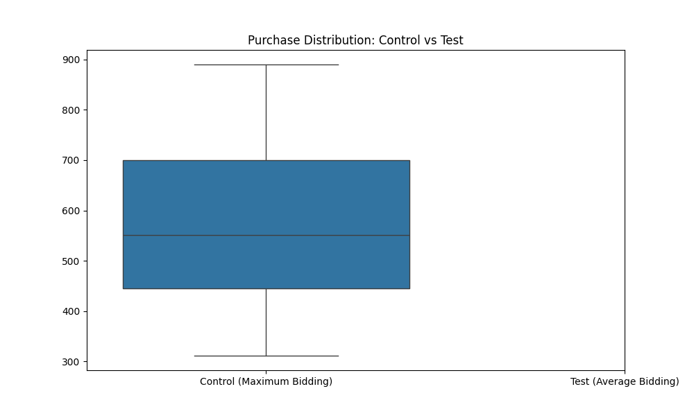

# A/B Testing: Comparison of Bidding Strategies

## Project Overview
[cite_start]This project evaluates the performance of the newly introduced **Average Bidding** strategy against the legacy **Maximum Bidding** method for the e-commerce platform *bombabomba.com*[cite: 11]. [cite_start]The primary objective is to determine whether the new strategy leads to a statistically significant increase in the **Purchase** metric, which is defined as the ultimate success criterion for the client[cite: 13].

---

## Dataset Characteristics
[cite_start]The analysis is based on 1 month of A/B test data containing the following metrics[cite: 12, 17, 20]:
* [cite_start]**Control Group:** Maximum Bidding[cite: 19].
* [cite_start]**Test Group:** Average Bidding[cite: 19].
* [cite_start]**Key Metrics:** Impressions, Clicks, Purchase (Target), and Earning[cite: 20].

---

## Statistical Methodology

### 1. Assumption Testing
Before conducting the hypothesis test, the data was checked for the following statistical assumptions:
* [cite_start]**Normality:** Shapiro-Wilk test was applied to both groups to ensure data follows a normal distribution[cite: 46, 50].
* [cite_start]**Variance Homogeneity:** Levene’s test was utilized to check the equality of variances between the groups[cite: 51, 55].

### 2. Hypothesis Testing
[cite_start]As both normality and variance homogeneity assumptions were met ($p > 0.05$), an **Independent Two-Sample T-Test** was performed to compare the means of the "Purchase" variable[cite: 45, 57].

---

## Findings and Business Recommendations

### Visual Analysis


### Test Results
* **P-Value:** 0.3493
* **Decision:** Fail to reject the Null Hypothesis ($H_0$).

### Executive Summary
The statistical analysis indicates **no significant difference** between the İthe two bidding strategies regarding total purchases ($p > 0.05$). From a data-driven perspective, transitioning to "Average Bidding" does not yield a measurable conversion advantage based on the current 1-month sample size.

---

## Technical Setup
1. **Requirements:** `pandas`, `scipy`, `matplotlib`, `seaborn`, `openpyxl`.
2. **Execution:** Run the following command in your terminal to generate the report and visualizations:
   ```bash
   python scripts/main_analysis.py